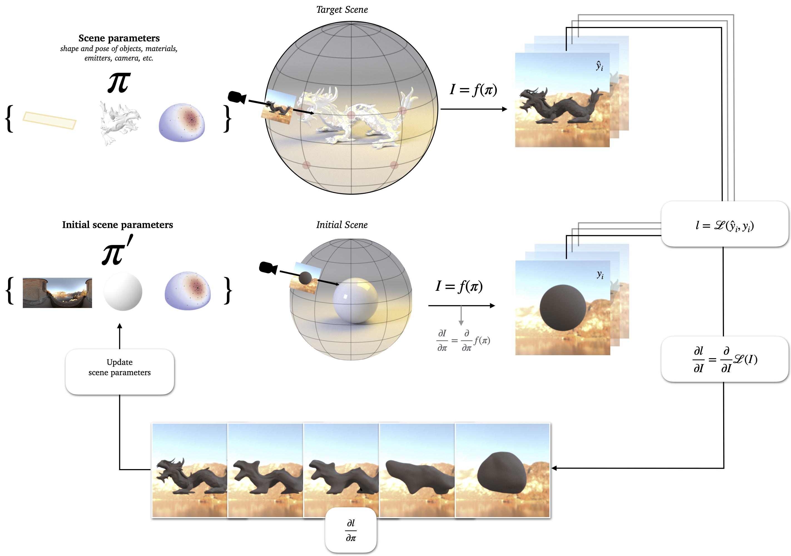

# Metamers Rendered Differentiably (MRD)



This is the repository accompanying our paper [*MRD: Using Physically Based Differentiable Rendering to Probe Vision Models for 3D Scene Understanding*](https://arxiv.org/abs/2512.12307).
```bibtex

@misc{beilharz2025mrdusingphysicallybased,
      title={MRD: Using Physically Based Differentiable Rendering to Probe Vision Models for 3D Scene Understanding}, 
      author={Benjamin Beilharz and Thomas S. A. Wallis},
      year={2025},
      eprint={2512.12307},
      archivePrefix={arXiv},
      primaryClass={cs.CV},
      url={https://arxiv.org/abs/2512.12307}, 
}
```

**The repository structure is as following:**
- `src`: Yields all experiments and code to facilitate the optimization of metamers.
- `vendor`: 3rd party repositories (modelsvshumans)

## Install

### Quick Setup (Recommended)
Download the repo as usual with `git` or `gh`, then run the automated setup script:
```bash
git clone https://github.com/ag-perception-wallis-lab/MRD
cd MRD
./setup.sh
```

The setup script will automatically:
- Update git submodules
- Detect your GPU (sets `cuda` variant if NVIDIA GPU is found, otherwise `llvm_ad_rgb`)
- Configure the `.envrc` file with the appropriate variant
- Extract the assets archive
- Install dependencies using `uv` (if available)

After setup completes, source the environment:
```bash
source .envrc
```

Or if using `direnv`:
```bash
direnv allow
```

### Manual Setup
If you prefer to set up manually:

1. Pull the submodules: `git submodule update --init --recursive`

2. Extract the assets archive:
```bash
tar -xzf assets.tar.gz
```

3. Configure environment variables by sourcing `.envrc` (set `DEFAULT_MI_VARIANT` to `cuda` if you have an NVIDIA GPU, otherwise `llvm_ad_rgb`)

4. Get the project up and running by using `uv sync` or using the `pyproject.toml` as an installation target with `pip install .` (use `-e` if you intend to modify).

The project is set up using `direnv`. If you do not want to use `direnv` please `source .envrc` to get the right environment variables.

## Usage
You can view the help page using `main.py -h`.
Generally, you would start an experiment by evoking `src/main.py` (we expect you to invoke from project root), for example: `PYTHONPATH=. python src/main.py dragon hallstatt lpips`. This would source the default arguments as used in the paper in `src/config.py`, otherwise you could also supply different parameters via flags which will overwrite the default arguments. Note that some arguments are only permitted for shape experiments, such as `-l` for the lamdba regularization factor. We mainly use Weights and Biases to store experiment results (the plot scripts assume that we will store the logs under `./wandb`). Reconstruction videos of the run will be produced and stored in `./results`.


```bash
usage: main.py [-h] [-p PATH] [--spp SPP] [--seed SEED] [-e EPOCHS] [-d DIMS] [-n NVIEWS] [--lr LR] [--forward] [--classify] [-l L] [--remesh REMESH] [--wandb] [--wandb-name WANDB_NAME] [--wandb-project WANDB_PROJECT]
               {dragon,dog,lion,lionstatue,suzanne,translucent,diffuse,brushed_metal,rosaline,aurora} {hallstatt,skybox,garden,constant} {mae,dual_buffer,dino,clip,resnet,resnet_sin,vggloss,lpips,vgg}

positional arguments:
  {dragon,dog,lion,lionstatue,suzanne,translucent,diffuse,brushed_metal,rosaline,aurora}
                        The scene to load.
  {hallstatt,skybox,garden,constant}
                        The environment map to load.
  {mae,dual_buffer,dino,clip,resnet,resnet_sin,vggloss,lpips,vgg}
                        Specify the model used for the reconstruction.

options:
  -h, --help            show this help message and exit

Experiment Settings:
  These settings will be passed to experiment configuration and mainly handle hyperparameters and some flags.

  --spp SPP                     Samples per pixel.
  --seed SEED                   The seed to use.
  -e EPOCHS, --epochs EPOCHS    The number of epochs to run the experiment for.
  -d DIMS, --dims DIMS          Image dimensions of the rendered images. Must match the original training size of the model used (256 for CNNs, 224 for Transformer-based architectures).
  -n NVIEWS, --nviews NVIEWS    Number of views
  --lr LR                       Learning rate
  --forward                     Whether to compute and visualize the forward gradients (requires Wandb logging).
  --classify                    Whether to use a classification loss for ResNets.

Shape experiment:
  These are parameters only relevant for the shape reconstruction.

  -l L                          Regularization factor for Large Steps gradient conditioning (controls the smoothness).
  --remesh REMESH               The remeshing steps passed as a space delimited string, i.e. 10 20, defines remeshing steps at epoch 10 and 20.

Logging:
  --wandb                       Whether to use wandb logging or not. Sources the credentials from the environment variables.
  --wandb-name WANDB_NAME       The experiment name.
  --wandb-project WANDB_PROJECT The name of the wandb project.
```

## Implementing your own MRD pipeline
In theory, you can extend the experiments by either providing your own models or scenes.

### Adding a scene
To add a scene you will need to add the dictionary configuration in `src/scenes.py` and add the dictionary to the `Scenes` enum. If you want to define default arguments, please create a new config in `src/config.py` and add the case to the `match` statement starting in `src/main.py` [L148](https://github.com/pixelsandpointers/MRD/blob/ff3c7df01d9397a4e4145d01b95a2505aba09560/src/main.py#L148).

### Adding a model
Right now, the implementation only supports optimization on a single GPU, therefore you need to make sure that both your model and DrJit has enough VRAM available.

To add a model, you derive from `ModelMixin` in `src/model.py` and implement the abstract methods `__str__`, `__call__` and `lossfn`. Multiple examples are available in the file itself.

If you use PyTorch for your model, please make sure to decorate the `lossfn` with `@dr.wrap('drjit', 'torch')`. This way DrJit will automatically merge PyTorch's autodiff graph with its own and enables backprop through the whole pipeline.

Please add the model to the `Model` enum to use it with `src/main.py`.

## Geometric Regularization Losses 

This implementation adds four geometric regularization losses. (Not used in the experiments).

### Implementation Details
- All losses are **differentiable** using DrJit operations
- Losses are automatically initialized on first use
- After remeshing, losses are reinitialized with the new topology
- Set any `lambda_*` to `0.0` to disable that loss
- ARAP loss stores initial edge directions from the starting mesh

### Available Losses
1. **Laplacian Loss** (`lambda_lap`): Penalizes deviations of vertices from the mean of their neighbors (smoothness)
2. **Edge Length Loss** (`lambda_edge`): Enforces uniform edge lengths by penalizing variance
3. **Triangle Area Loss** (`lambda_area`): Enforces uniform triangle areas by penalizing variance
4. **ARAP Loss** (`lambda_arap`): Preserves original edge orientations (As-Rigid-As-Possible)

### Usage
#### 1. Set regularization weights in GeometryConfig

```python
from config import GeometryConfig

# Create a custom config with regularization
config = GeometryConfig(
    n_views=25,
    lambda_reg=15,      # Existing regularization parameter
    lr=1e-1,
    remesh=[5, 25, 50, 100, 150, 250, 350, 450],
    epochs=500,
    # New geometric regularization parameters
    lambda_lap=0.1,     # Laplacian smoothness
    lambda_edge=0.05,   # Uniform edge lengths
    lambda_area=0.05,   # Uniform triangle areas
    lambda_arap=0.1,    # As-Rigid-As-Possible
)
```

#### 2. Use with shape reconstruction

```python
from config import Config, GeometryConfig
from model import DINO
from shape import reconstruct_geometry

# Setup main config
cfg = Config(
    dims=[256, 256],
    model=DINO(),
    scene=your_scene_dict,
    envmap="path/to/envmap.exr",
    spp=32
)

# Setup geometry config with regularization
geom_cfg = GeometryConfig(
    n_views=25,
    lambda_reg=15,
    lr=1e-1,
    remesh=[100, 200, 300],
    lambda_lap=0.1,    # Enable Laplacian smoothing
    lambda_area=0.05,  # Enable area uniformity
)

# Run reconstruction with regularization
logs = reconstruct_geometry(
    cfg=cfg,
    geom_cfg=geom_cfg,
    logs={"loss": [], "similarity": []},
    wandb_project="my_project",
    wandb_experiment_name="shape_with_regularization"
)
```

